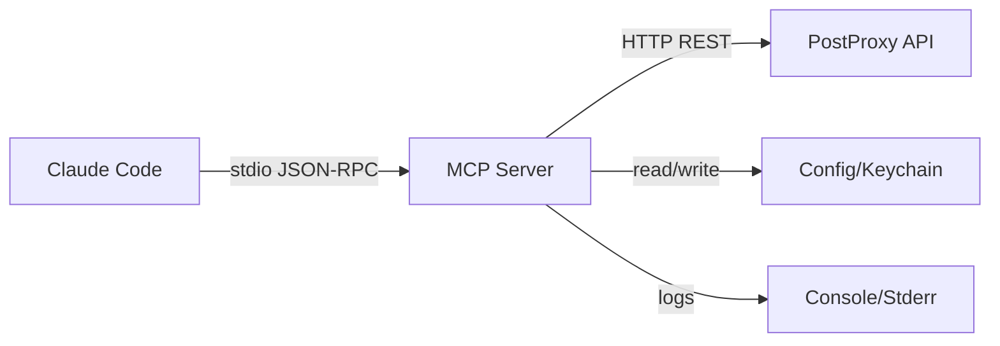

# План реализации PostProxy MCP Server

## Архитектура

MCP сервер будет реализован как TypeScript CLI приложение, работающее через stdio transport. Сервер выступает тонкой прослойкой между Claude Code и PostProxy API, делегируя всю бизнес-логику публикации и ретраев PostProxy.



## Структура проекта

```
postproxy-mcp/
├── src/
│   ├── index.ts                 # Entry point, MCP server initialization
│   ├── server.ts                # MCP server setup and tool registration
│   ├── tools/
│   │   ├── auth.ts              # auth.status, auth.whoami
│   │   ├── accounts.ts          # accounts.list
│   │   ├── post.ts              # post.validate, post.publish, post.status, post.retry
│   │   └── history.ts           # history.list (optional)
│   ├── api/
│   │   └── client.ts            # PostProxy API HTTP client
│   ├── auth/
│   │   ├── credentials.ts       # Reading API key from env/keychain/file
│   │   └── keychain.ts          # OS keychain integration (keytar)
│   ├── utils/
│   │   ├── idempotency.ts       # Generate idempotency keys
│   │   ├── validation.ts        # Payload validation schemas
│   │   ├── logger.ts            # Secure logging (no secrets)
│   │   └── errors.ts            # Error types and formatting
│   └── types/
│       └── index.ts             # TypeScript types for API responses
├── package.json
├── tsconfig.json
├── README.md                     # Installation and Claude Code integration guide
└── docs/
    ├── tools.md                  # Tool descriptions and schemas
    └── examples.md               # Example prompts and usage
```

## Технологический стек

- **Language**: TypeScript (Node.js >= 18)
- **MCP SDK**: `@modelcontextprotocol/sdk` (официальный SDK от Anthropic)
- **HTTP Client**: `node-fetch` или встроенный `fetch` (Node 18+)
- **Keychain**: `keytar` для OS keychain integration
- **Validation**: `zod` для JSON schema validation
- **CLI**: `commander` или встроенный `process.argv`

## Реализация по этапам

### Этап 1: Базовая структура и MCP server setup

**Файлы**: `src/index.ts`, `src/server.ts`

- Инициализация MCP server через `@modelcontextprotocol/sdk`
- Настройка stdio transport (stdin/stdout)
- Регистрация всех tools
- Обработка инициализации и lifecycle событий

**Ключевые моменты**:

- Server должен запускаться как `postproxy-mcp` команда
- Читать `POSTPROXY_API_KEY` и `POSTPROXY_BASE_URL` из env при старте
- Возвращать список доступных tools при инициализации

### Этап 2: Аутентификация и конфигурация

**Файлы**: `src/auth/credentials.ts`, `src/auth/keychain.ts`

**Приоритет источников API ключа**:

1. Environment variable `POSTPROXY_API_KEY` (обязательный для MVP)
2. OS Keychain (macOS Keychain / Windows Credential Manager / libsecret)
3. Fallback: `~/.postproxy-mcp/config.json` (права 600)

**Реализация**:

- `getApiKey()`: читает ключ по приоритету, возвращает `null` если не найден
- `saveApiKey(key)`: сохраняет в keychain (если доступен) или файл
- Проверка валидности ключа через тестовый запрос к PostProxy API

**Tools**:

- `auth.status`: возвращает `{ authenticated: boolean, base_url: string, workspace_id?: string }`
- `auth.whoami`: если PostProxy API поддерживает `/me` или `/workspace`, возвращает идентификатор

### Этап 3: PostProxy API Client

**Файл**: `src/api/client.ts`

**Класс `PostProxyClient`**:

```typescript
class PostProxyClient {
  constructor(apiKey: string, baseUrl?: string)
  async getProfileGroups(): Promise<ProfileGroup[]>
  async getProfiles(groupId?: number): Promise<Profile[]>
  async createPost(params: CreatePostParams): Promise<CreatePostResponse>
  async getPost(postId: string): Promise<PostDetails>
  async updatePost(postId: string, params: UpdatePostParams): Promise<PostDetails>
  async deletePost(postId: string): Promise<void>
  async listPosts(limit?: number): Promise<Post[]>
}
```

**Формат запросов** (на основе анализа ноды):

- Base URL: `POSTPROXY_BASE_URL` или `https://api.postproxy.dev/api`
- Auth header: `Authorization: Bearer ${apiKey}`
- Content-Type: `application/json`
- Timeout: 30 секунд

**Обработка ошибок**:

- Извлечение `x-request-id` из headers для логирования
- Маппинг HTTP статусов в понятные ошибки
- Возврат структурированных ошибок с кодом и сообщением

### Этап 4: Tools реализация

#### 4.1 `accounts.list`

**Файл**: `src/tools/accounts.ts`

**Логика**:

- Вызывает `client.getProfileGroups()` и `client.getProfiles()`
- Возвращает список targets в формате:
  ```typescript
  {
    targets: Array<{
      id: string,
      name: string,
      platform: string,
      profile_group_id: number,
      status: string
    }>
  }
  ```


**Ошибки**:

- `AUTH_MISSING`: если API ключ не найден
- `API_ERROR`: если запрос к PostProxy провалился

#### 4.2 `post.validate`

**Файл**: `src/tools/post.ts`

**Логика**:

- Валидация payload (content не пустой, media URLs валидные)
- Проверка targets (существуют ли через `accounts.list`)
- Проверка schedule (если указан, формат ISO 8601, время в будущем)
- Нормализация payload (trim content, сортировка media URLs)

**Возврат**:

```typescript
{
  valid: boolean,
  errors: string[],
  warnings: string[],
  normalized_payload: {
    content: string,
    targets: string[],
    schedule?: string,
    media?: string[]
  }
}
```

#### 4.3 `post.publish`

**Файл**: `src/tools/post.ts`

**Параметры**:

- `content`: string (обязательный)
- `targets`: string[] (обязательный, массив profile IDs)
- `schedule?: string` (ISO 8601, опционально)
- `media?: string[]` (URLs, опционально)
- `idempotency_key?: string` (опционально)
- `require_confirmation?: boolean` (опционально, для UX guardrails)

**Логика**:

- Если `require_confirmation=true`: возвращает summary без публикации
- Иначе: вызывает `client.createPost()` с преобразованием targets в `profile_group_id` и `profiles`
- Генерирует `idempotency_key` если не передан (через `utils/idempotency.ts`)

**Возврат**:

```typescript
{
  job_id: string,  // post.id из ответа
  accepted_at: string,
  status: string,
  summary?: {
    targets: string[],
    content_preview: string,
    media_count: number,
    schedule_time?: string
  }
}
```

**Преобразование targets**:

- Нужно определить `profile_group_id` из первого target (через `accounts.list`)
- `profiles` - массив target IDs

#### 4.4 `post.status`

**Файл**: `src/tools/post.ts`

**Параметры**: `job_id: string`

**Логика**:

- Вызывает `client.getPost(job_id)`
- Парсит ответ в формат per-platform outcomes

**Возврат**:

```typescript
{
  job_id: string,
  overall_status: "pending" | "processing" | "complete" | "failed",
  platforms: Array<{
    platform: string,
    status: "ok" | "error" | "retrying",
    url?: string,
    error_reason?: string,
    retryable?: boolean
  }>
}
```

#### 4.5 `post.retry`

**Файл**: `src/tools/post.ts`

**Параметры**:

- `job_id: string`
- `platforms?: string[]` (опционально, для ретрая только конкретных платформ)

**Логика**:

- Получает текущий статус через `post.status`
- Определяет упавшие платформы
- Если `platforms` указан, фильтрует только их
- Вызывает `client.createPost()` с теми же параметрами (из оригинального поста) + новый `idempotency_key`

**Возврат**:

```typescript
{
  job_id: string,  // новый job_id
  retried_platforms: string[],
  original_job_id: string
}
```

**Примечание**: Поскольку отдельного retry endpoint нет, используем повторный create с новым idempotency_key.

#### 4.6 `history.list` (optional)

**Файл**: `src/tools/history.ts`

**Логика**:

- Вызывает `client.listPosts(limit)`
- Возвращает краткий summary последних jobs

**Возврат**:

```typescript
{
  jobs: Array<{
    job_id: string,
    content_preview: string,
    created_at: string,
    overall_status: string,
    platforms_count: number
  }>
}
```

### Этап 5: Утилиты

#### 5.1 Idempotency Key Generation

**Файл**: `src/utils/idempotency.ts`

**Функция**: `generateIdempotencyKey(content: string, targets: string[], schedule?: string): string`

- Нормализует входные данные (trim, sort)
- Генерирует SHA256 hash от JSON строки
- Возвращает hex строку

#### 5.2 Validation Schemas

**Файл**: `src/utils/validation.ts`

**Использование Zod**:

- Schema для `post.publish` параметров
- Schema для `post.validate` параметров
- Валидация ISO 8601 дат
- Валидация URL для media

#### 5.3 Secure Logging

**Файл**: `src/utils/logger.ts`

**Правила**:

- По умолчанию: только tool name, job_id, outcome
- Debug mode (`POSTPROXY_MCP_DEBUG=1`): больше деталей, но без секретов
- Фильтрация: удалять API ключи, токены из логов
- Логи в stderr, результаты в stdout (для MCP)

#### 5.4 Error Handling

**Файл**: `src/utils/errors.ts`

**Типы ошибок**:

- `AUTH_MISSING`: нет API ключа
- `AUTH_INVALID`: невалидный ключ
- `VALIDATION_ERROR`: ошибка валидации payload
- `TARGET_NOT_FOUND`: target не существует
- `PUBLISH_FAILED`: ошибка публикации
- `PLATFORM_ERROR`: ошибка конкретной платформы
- `API_ERROR`: общая ошибка API

**Формат**:

```typescript
{
  code: string,
  message: string,
  details?: any
}
```

### Этап 6: Интеграция с Claude Code

**Файл**: `README.md`

**Документация должна включать**:

1. **Установка**:
   ```bash
   npm install -g postproxy-mcp
   # или локально
   npm install postproxy-mcp
   ```

2. **Настройка Claude Code**:

Добавить в `~/.config/claude/claude_desktop_config.json` (или аналог):

   ```json
   {
     "mcpServers": {
       "postproxy": {
         "command": "postproxy-mcp",
         "env": {
           "POSTPROXY_API_KEY": "your-api-key",
           "POSTPROXY_BASE_URL": "https://api.postproxy.dev/api"
         }
       }
     }
   }
   ```

3. **Проверка подключения**:

   - Запустить Claude Code
   - Проверить, что tools видны в списке доступных
   - Вызвать `auth.status` для проверки аутентификации

4. **Примеры промптов**:

   - "Покажи список моих аккаунтов"
   - "Валидируй этот пост: [content] для аккаунтов [targets]"
   - "Опубликуй пост [content] в [targets]"
   - "Проверь статус job [job_id]"
   - "Ретрай упавшие платформы для job [job_id]"

### Этап 7: Package.json и сборка

**Файл**: `package.json`

**Ключевые поля**:

```json
{
  "name": "postproxy-mcp",
  "version": "0.1.0",
  "bin": {
    "postproxy-mcp": "./dist/index.js"
  },
  "main": "./dist/index.js",
  "scripts": {
    "build": "tsc",
    "dev": "tsc --watch",
    "prepare": "npm run build"
  }
}
```

**Dependencies**:

- `@modelcontextprotocol/sdk`: MCP SDK
- `keytar`: OS keychain
- `zod`: validation
- `node-fetch`: HTTP client (если Node < 18)

**DevDependencies**:

- `typescript`
- `@types/node`

## Definition of Done Checklist

- [ ] MCP server запускается через `postproxy-mcp` команду
- [ ] `auth.status` показывает `authenticated: false` без ключа, `true` с ключом
- [ ] `accounts.list` возвращает список targets
- [ ] `post.validate` ловит ошибки валидации
- [ ] `post.publish` возвращает `job_id` быстро (асинхронно)
- [ ] `post.status` показывает per-platform outcomes с URL/ID при успехе
- [ ] `post.retry` работает через повторный create
- [ ] Логи не содержат секретов
- [ ] Idempotency работает корректно
- [ ] Документация по установке и интеграции с Claude Code готова
- [ ] Примеры промптов и использования добавлены

## Дополнительные соображения

1. **Преобразование targets**: В ноде используется `profile_group_id` + массив `profiles`. Нужно определить логику маппинга targets (которые могут быть profile IDs) в эту структуру.

2. **Idempotency**: Если PostProxy не поддерживает idempotency_key напрямую, генерируем его локально и используем для дедупликации на стороне MCP server (кеш последних job_id по ключу).

3. **Rate limiting**: MCP server не должен реализовывать rate limiting - это задача PostProxy. Но можно добавить retry с exponential backoff для временных ошибок API.

4. **Тестирование**: Для MVP достаточно ручного тестирования через Claude Code. В будущем можно добавить unit/integration тесты.